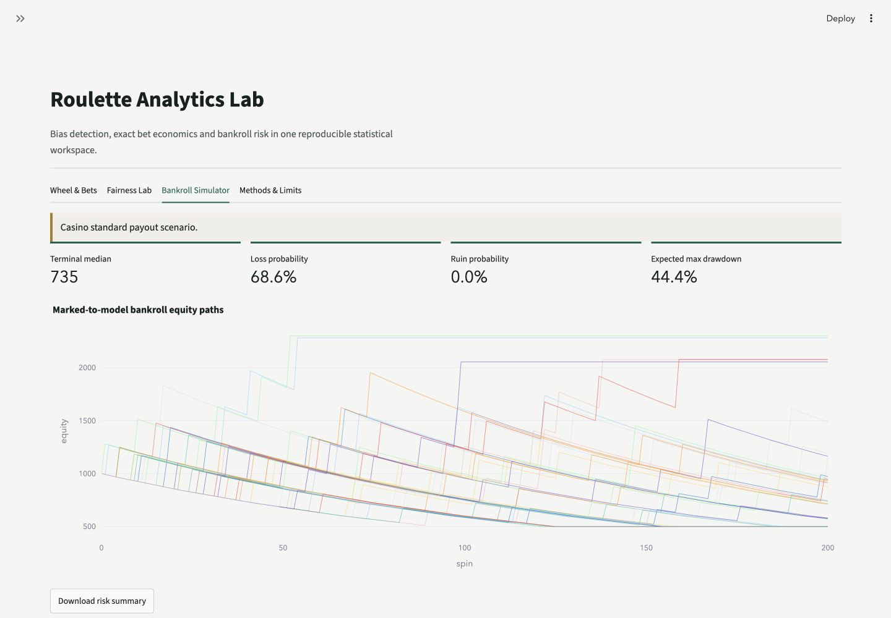
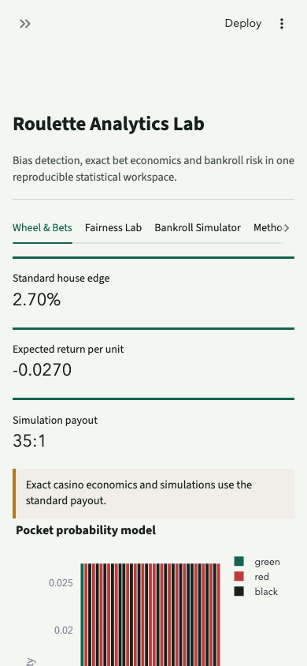

# Roulette Analytics Lab

**Optimal Betting Strategy Simulator: A Statistical Laboratory for Roulette Bias, Bankroll Risk and Decision-Making**

[Verified public Streamlit dashboard](https://roulette-analytics-lab.streamlit.app/)

Roulette Analytics Lab is a reproducible Python portfolio project built from the mathematical questions studied in the University of Manchester MATH20062 Group 40 report. It turns a static academic investigation into a tested package, a deterministic analysis pipeline, an executed notebook, a CSV-backed PDF report, and a Streamlit dashboard. It asks how casino roulette rules determine expected value, what fixed-horizon evidence says about fairness, and how selection, repeated observation, changing probabilities, and uncertainty affect a decision.

This is an educational probability project, not a system for making money from gambling. Under a fair wheel and standard casino payouts, every conventional bet has negative expected net return.

## Project background

The source report was written by Jialiang Gong, Joseph Myatt, Jessica Sathiyanathan, Jacob Tinker, and Chenyue Wang for MATH20062 in 2024/25. This repository credits that shared foundation and separates it from Jialiang Gong's subsequent individual work. The source PDF is not redistributed because coauthor publication consent has not been established. Its identity and SHA-256 checksum are recorded in [docs/provenance.md](docs/provenance.md).

The individual extension is an independent Python reimplementation from the paper's mathematical specification. The original MATLAB files were unavailable, so this repository does not claim line-by-line migration. New work includes a typed domain model, complete bet geometry, exact treatment of European special rules, corrected post-selection inference, Monte Carlo power analysis, risk-aware bankroll simulation, automated tests, an interactive product, and publication-ready outputs.

## Questions answered

1. What are the exact expected returns of European and American roulette bets?
2. How do La Partage and En Prison change the edge on even-money bets?
3. How quickly does a running frequency approach its theoretical probability?
4. Can a chi-squared test detect a wheel with one elevated pocket probability?
5. Why is testing the hottest observed pocket as though it were chosen in advance invalid?
6. How do fixed-horizon, post-selection, sequential, and change-point questions require different statistical procedures?
7. What does Kelly mean under an assumed edge, and how do posterior uncertainty, drawdown, and CVaR alter a constrained comparison?

## Mathematical methods

The package combines finite probability spaces, expectation, random walks, law-of-large-numbers convergence, categorical goodness-of-fit testing, Monte Carlo calibration, post-selection correction, sequential likelihood-ratio evidence, Page-style CUSUM diagnostics, Bayesian updating, conditional Kelly sizing, and CVaR risk analysis. Exact enumeration is used when the wheel rules are fully specified. Simulation is used for path-dependent quantities and sampling distributions that are awkward to derive analytically.

For a unit stake with net payout odds `b` and win probability `p`, the expected net return is

```text
E[X] = p b - (1 - p).
```

The standard European straight bet has `p = 1/37` and `b = 35`, so `E[X] = -1/37`. The generated [`house_edges.csv`](outputs/tables/house_edges.csv) table holds all displayed house-edge values. The full Kelly fraction, when the assumed `p` is known and greater than break-even, is `(bp - (1-p))/b`. Here, optimal means constrained expected-log-growth under the assumed edge and model. It is not a guarantee or an estimate of a real casino advantage. Fair roulette has zero Kelly because its standard payout sits below break-even.

## Architecture

```text
app.py                          Streamlit entry point
src/roulette_lab/               Tested probability, inference, and simulation package
scripts/run_analysis.py         Deterministic data and publication-output pipeline
scripts/build_notebook.py       Rebuilds and executes the teaching notebook
scripts/build_report_pdf.py     Builds the A4 technical report from Markdown and CSV data
data/                           Reproducible synthetic spin samples
outputs/tables/                 Machine-readable headline results
outputs/figures/                Publication figures
notebooks/                      Executed end-to-end analysis notebook
report/                         Long-form report in Markdown and PDF
docs/                           Blog, provenance, methods, AI workflow, and application material
tests/                          Unit, integration, publication, and reproducibility tests
```

The package keeps wheel mechanics, bet definitions, statistical inference, bankroll rules, and presentation logic separate. This makes claims easier to test and prevents dashboard controls from silently changing the mathematical model.

## Installation

Python 3.12 is required.

```bash
python3.12 -m venv .venv
source .venv/bin/activate
python -m pip install -r requirements-lock.txt
```

## Commands

Run the deterministic analysis:

```bash
.venv/bin/python scripts/run_analysis.py
```

Rebuild and execute the notebook:

```bash
.venv/bin/python scripts/build_notebook.py
```

Launch the dashboard:

```bash
.venv/bin/streamlit run app.py
```

Run the tests:

```bash
.venv/bin/python -m pytest -q
```

## Dashboard controls

The five views move from observation to evidence and decisions. **Live Experiment** runs the seeded wheel, records bankroll and spin history, and accepts strict CSV input. **Evidence** compares fixed-horizon, post-selection-aware, sequential, and CUSUM results. **Decision Risk** presents posterior edge uncertainty, Kelly outputs, and the CVaR risk frontier. **Wheel Mechanics** explains wheel types, bet geometry, payouts, and special European rules. **Methods** states the assumptions and limits needed to interpret every output.

Custom payout odds are deliberately labelled hypothetical and simulation-only. They never overwrite the casino-standard analytical tables.

## Published results

All publication headline values are loaded from named generated CSVs, never recomputed or typed into prose. [`house_edges.csv`](outputs/tables/house_edges.csv) records the casino contract. [`bias_tests.csv`](outputs/tables/bias_tests.csv) records fixed-horizon global, naive, and family-wise evidence. [`sequential_evidence.csv`](outputs/tables/sequential_evidence.csv) records the pre-specified likelihood-ratio process. [`change_point_results.csv`](outputs/tables/change_point_results.csv) records CUSUM alarms and operating characteristics for synthetic scenarios. [`posterior_edge.csv`](outputs/tables/posterior_edge.csv) records the probability input, interval, break-even comparison, and explicitly heuristic lower-quantile Kelly. [`risk_frontier.csv`](outputs/tables/risk_frontier.csv) records common-random-number growth, loss, drawdown, and CVaR comparisons.

The report explains the difference between a fixed-horizon question, a post-selected claim, a sequential stopping rule, and a change-point diagnostic. It also documents the CVaR convention: non-negative terminal shortfall is `max(initial bankroll - terminal equity, 0)`, and larger values are worse. The synthetic favourable scenario is for stress-testing decision rules, not evidence of a real casino edge.

## Screenshots

The screenshots below were generated from the tested V2 interface. The full interaction record is in [docs/visual_qa.md](docs/visual_qa.md).

### Desktop: bankroll paths and risk metrics



### Mobile: wheel economics and probability model



Existing seven tables and six figures remain. The final release contains eleven tables and ten figures. These include deterministic sequential-evidence, change-point, posterior-edge, and risk-frontier outputs in [outputs](outputs). The canonical [verified public deployment](https://roulette-analytics-lab.streamlit.app/) returned HTTP 200 at its unchanged URL when a fresh anonymous cookie jar retained the server-issued Streamlit session and CSRF cookies across redirects. The local launch command above runs the app from source.

## Reproducibility

Every synthetic dataset and Monte Carlo procedure uses a recorded seed. Publication tables are CSV files, and the report builder resolves headline markers from those files rather than duplicating numbers by hand. The notebook imports production functions, loads generated tables, has stable cell identifiers, and is executed before release. Dependency versions are pinned in `requirements-lock.txt`. The final verifier checks tests, output freshness, notebook execution, report presence, and package contents.

Statistical reproducibility does not remove model uncertainty. A fixed seed reproduces a computation; it does not prove that an assumed pocket probability describes a real wheel.

## AI use

AI tools supported code review, test ideation, documentation structure, and prose editing. Mathematical claims, formulas, generated evidence, and file-level outputs were checked through executable tests and deterministic scripts. Details, boundaries, and verification practices are documented in [docs/ai_workflow.md](docs/ai_workflow.md). AI output is treated as a draft or hypothesis until it passes an independent check.

## Limitations

The supplied spin records are synthetic, not casino observations. The one-pocket alternative is intentionally simple. Spins are modelled as independent and identically distributed unless a specific wheel says otherwise. Results may not transfer to wheels with temporal drift, dealer signatures, measurement error, or changing operating conditions. A statistically detectable deviation is not automatically large enough, stable enough, or legal to exploit. Kelly calculations are highly sensitive to probability error.

## Responsible gambling

Roulette is a negative-expectation game under standard fair-wheel rules. Progression systems do not change the expected value of the underlying bet. Stop-loss and take-profit rules change exposure and the shape of outcomes, but do not create positive expectation. Anyone experiencing harm related to gambling should stop and seek qualified local support.

## Licence

Code is released under the MIT License. The source group report is not included and remains subject to its authors' rights. Generated portfolio prose and figures may be cited with attribution.

## Citation

```bibtex
@software{gong2026roulette,
  author  = {Jialiang Gong},
  title   = {Roulette Analytics Lab},
  year    = {2026},
  version = {0.1.0},
  note    = {Independent Python portfolio extension of the MATH20062 Group 40 report}
}
```
