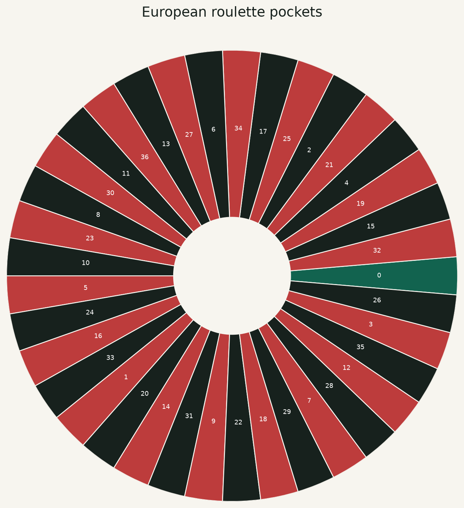
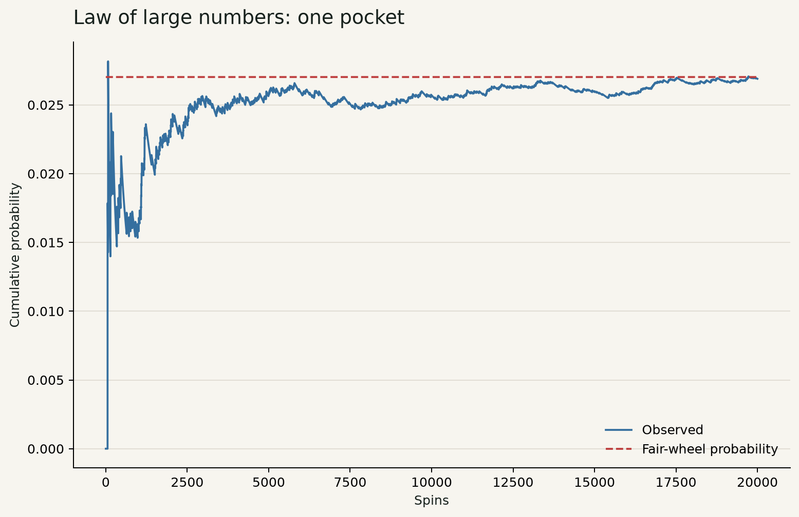
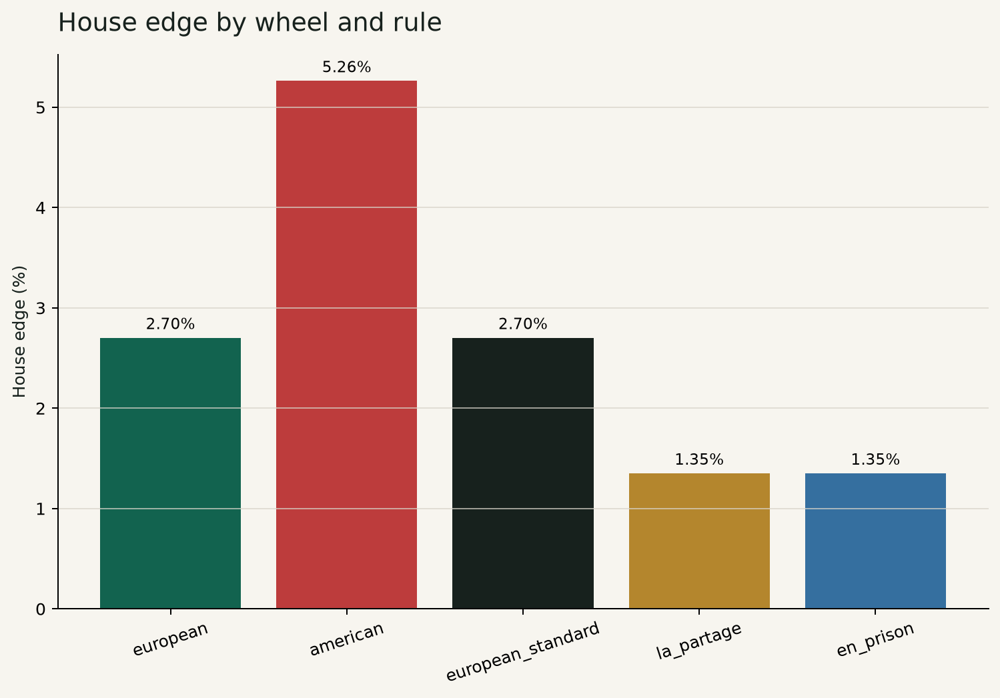
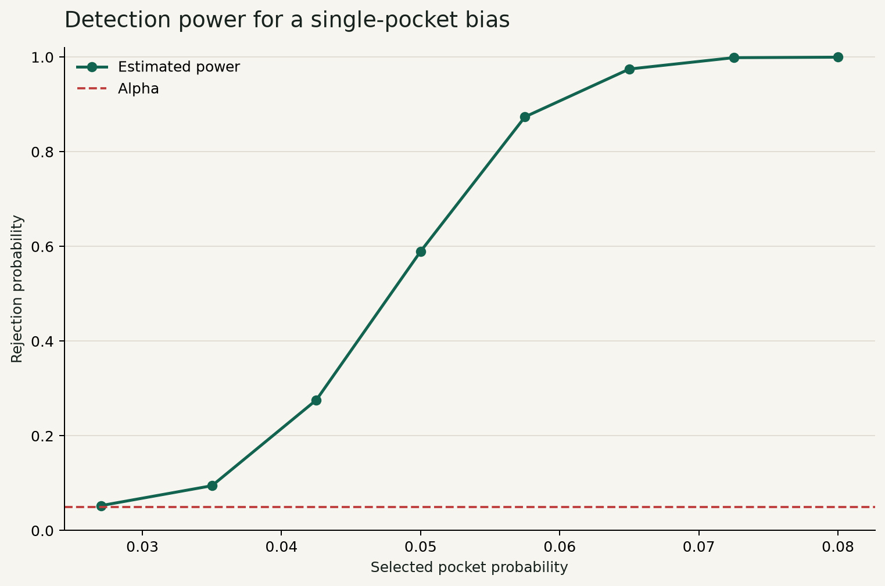
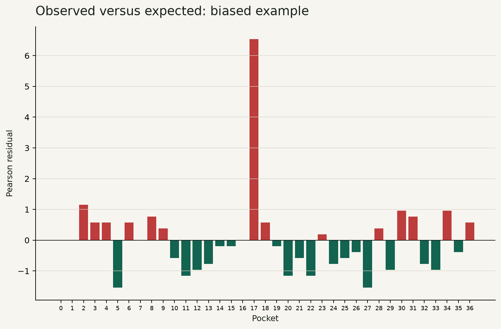
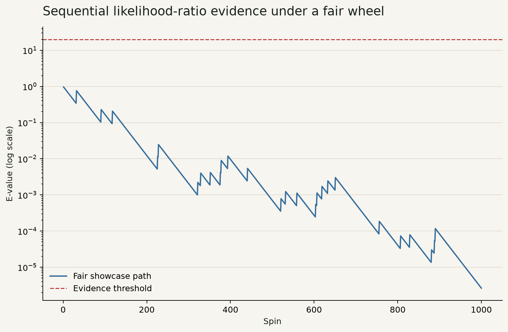
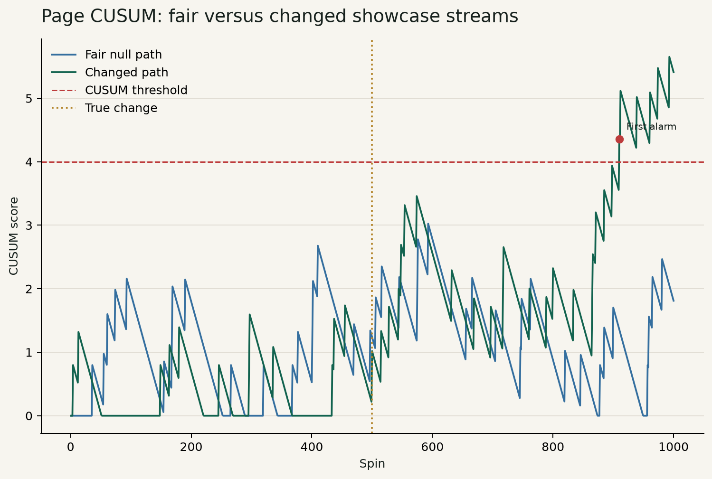
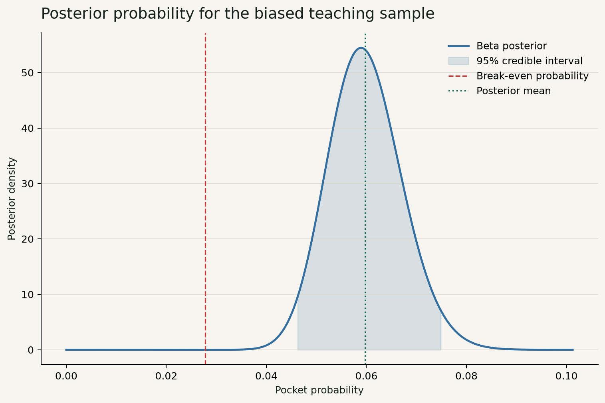
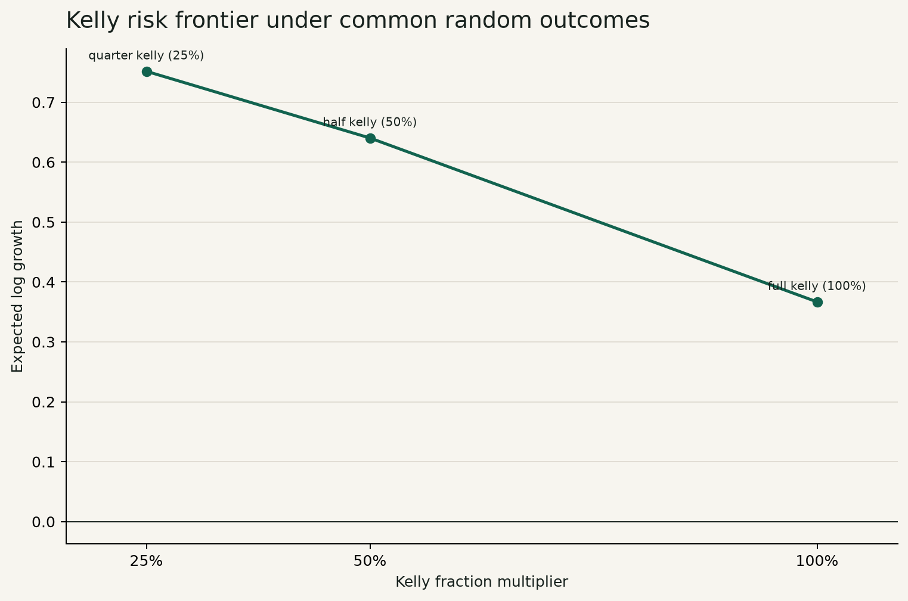

# Roulette Analytics Lab V2

## Executive Summary

Roulette Analytics Lab is a statistical laboratory built around casino roulette, rather than a claim that roulette can be beaten. The game is useful because the contract is unusually clear. A wheel supplies a finite outcome space, a bet specifies its winning pockets, and the casino posts a payout. That clarity makes it possible to separate three questions that often get blurred together: what the rules imply before any data are observed, what a finite sample says about a possible departure from those rules, and what a decision rule would do if a probability assumption were accepted. The distinction matters. A streak is an observation. It is not automatically a reason to change a model or risk money.

The project began with a University of Manchester group mathematics report and became an independent Python reimplementation and extension. The original report supplied a good compact problem. This version makes the research question more demanding: what conclusions remain defensible after the interesting pocket was chosen from the data, the stream was inspected repeatedly, the underlying probability may have changed, and the probability used for a stake is uncertain? I chose roulette precisely because the answer should be conservative. A fair casino wheel retains a house edge, and no staking pattern removes it.

The package generates deterministic CSV evidence, figures, an executed notebook, an interactive Streamlit dashboard, and this report. Headline findings in this document are resolved by the PDF builder from named generated CSV tables. The European and American house edges come from `house_edges.csv`; fixed-horizon tests come from `bias_tests.csv`; monitoring and CUSUM examples use `sequential_evidence.csv` and `change_point_results.csv`; posterior decisions use `posterior_edge.csv`; and tail-risk comparisons use `risk_frontier.csv`. Those names are deliberately visible. They show a reader where a result came from and prevent report prose from becoming a second calculation layer.

The analysis has four central results. First, the fair European straight-up contract has negative expected return, so the correct Kelly stake is zero under that contract. Second, a seemingly unusual hottest pocket in a fair teaching sample loses its force after the search that selected it is represented. Third, a pre-specified likelihood-ratio monitor and a CUSUM diagnostic answer different questions from an ordinary fixed-horizon p-value. Fourth, even in a supplied favourable synthetic scenario, stake size changes loss probability, drawdown, and tail shortfall enough that a single average terminal bankroll is a poor ranking device.

The work is intended as evidence of mathematical reasoning, Python implementation, statistical judgement, and product thinking. It is not personal gambling advice. The biased examples are synthetic, the simulations are conditional on stated assumptions, and the dashboard keeps those assumptions adjustable because hiding them would make the product less honest.

## Research Question and Provenance

The research question is: how should an analyst reason about an apparent roulette advantage when the observation process itself may have influenced the claim? A conventional classroom exercise can stop after calculating expected value or applying chi-square. That is valuable groundwork, but it leaves open the harder parts. Did the analyst choose the target pocket before seeing the counts? Was the sample size fixed before looking? Are repeated peeks being treated as fresh tests? Is the same probability suitable for every part of the sequence? If the model is uncertain, what does the word optimal actually mean?

Roulette is casino roulette here. The standard European wheel has pockets 0 through 36. The American wheel adds 00. A straight-up wager wins only when its named pocket occurs and pays 35 units of net profit for each unit staked. The project also implements even-money bets and the European La Partage and En Prison rules. These details are not decoration. A probability model without the actual payout contract cannot determine expected return, break-even probability, or a Kelly fraction.

The academic source is the MATH20062 2024/25 Group 40 main project at the University of Manchester, written by Jialiang Gong, Joseph Myatt, Jessica Sathiyanathan, Jacob Tinker, and Chenyue Wang. The group PDF is not redistributed because permission from every coauthor has not been established. `docs/provenance.md` records its checksum and the contribution boundary. I do not claim that the original group work was an individual software project or that this repository is a MATLAB migration. The original MATLAB files were unavailable. This repository is an independent Python reimplementation from the mathematical specification, followed by additional tested work on selection correction, sequential evidence, posterior decisions, constrained simulation, and product design.

The teaching data have the same purposefully limited status. `data/example_unbiased_spins.csv` is a reproducible fair sample, while `data/example_biased_spins.csv` contains a synthetic elevated probability for one pocket. The latter asks whether the procedures respond as expected when a known departure has been injected. It does not report a casino observation or establish a mechanical defect. A reader should be able to find that limitation quickly, not after several pages of confident charts.

The resulting scope is deliberately narrow. The lab does not attempt to estimate live casino profitability, predict player behaviour, or discover an arbitrary form of dependence. It uses casino roulette as a controlled setting for inference and decision-making under uncertainty. That makes the project more useful to me than a dramatic casino narrative would be. The point is to show the work of specifying a question before declaring an answer.

## Probability Contract

The first contract is exact. For a one-unit straight-up bet with win probability p and net odds b, expected net return is `p*b - (1-p)`. The fair European probability is 1/37 and the posted net odds are 35, giving a negative return of -1/37 per unit. The generated `house_edges.csv` table reports the corresponding European house edge as `{{house_edges.csv|rule=european|house_edge|.2%}}`. With the additional American 00 pocket and the same payout, the table reports `{{house_edges.csv|rule=american|house_edge|.2%}}`. The difference is structural. The payout stayed fixed while the chance of winning fell.

This is the basic correction to a common intuition. A fair roulette wheel is not a fair wager merely because every pocket has the same probability. Fairness of the wheel means uniform pocket probabilities. Fairness of the bet depends on whether the payout compensates for those probabilities. On a European wheel, 35:1 net odds would need a win chance above 1/36 to produce positive expected return. The casino pays less than that break-even contract requires. House edge is therefore a feature of the rule, not a symptom of a long unlucky run.

The even-money special rules show why implementation detail matters. Under La Partage, a zero returns half of an even-money stake. En Prison holds that stake until a later non-zero spin settles it. Both reduce the long-run European disadvantage for qualifying bets; neither creates positive expectation. `house_edges.csv` contains the exact values under each implemented rule. The code models En Prison as a deferred state, rather than quietly substituting a half-loss approximation into a path simulation. That decision gave the tests something concrete to check: a stateful rule must settle consistently across future spins.

Probability also shapes path behaviour. Let a bankroll increment be the stake times the return from one spin. Repeated increments produce a random walk. A negative expected increment implies negative drift, yet no finite path is obliged to move down smoothly. Some paths rise early. Some rise for an uncomfortably long time. A law of large numbers result says that an empirical frequency or average return approaches its model quantity under its assumptions as sample size grows. It does not say a particular player will be rescued by waiting, nor does it turn an adverse payout into a favourable one.

`lln_convergence.csv` records the cumulative empirical frequency of the chosen teaching label against its theoretical probability. The random seed and every displayed spin are part of that output. The notebook uses the generated table alongside a random-walk figure so that the visual lesson stays modest: relative error settles irregularly, and short-run variation is real. I prefer this to presenting the law of large numbers as a slogan. The practical importance is that a finite sample can look strange without contradicting the model, while an expected loss can still include winning paths.

Kelly sits at the boundary between the probability contract and a decision contract. With correct repeated-trial probability p, net odds b, divisible capital, and logarithmic utility, full Kelly is `max(0, (b*p - (1-p))/b)`. It is optimal only in the restricted sense of maximizing assumed expected log growth under those conditions. It does not maximize every reasonable objective. It does not guarantee a profit. It does not license an estimate that has been selected after a search. Crucially, the fair European straight-up probability is below break-even, and `kelly_sensitivity.csv` reports zero full, half, and quarter Kelly at that fair input. Zero is the mathematically appropriate answer when the assumed edge is absent.

## Fixed-Horizon Inference

The fixed-horizon question asks whether a complete, pre-defined sample of wheel outcomes is compatible with a fair multinomial distribution. This lab answers that question with Pearson's chi-square statistic, an asymptotic reference distribution, and a multinomial Monte Carlo calibration. The global null concerns all pockets at once. It is a different question from whether one named pocket has an unusually high count.

For the fair teaching sample, `bias_tests.csv` records the spin count, hottest observed label, global chi-square statistic, asymptotic p-value, and simulation-calibrated global p-value. The generated asymptotic global p-value is `{{bias_tests.csv|dataset=unbiased|asymptotic_p_value|.4f}}`, with Monte Carlo value `{{bias_tests.csv|dataset=unbiased|monte_carlo_global_p_value|.4f}}`. These are not statements that the wheel has been proven fair. A p-value measures how surprising a statistic would be under a stated null and procedure. It does not verify the null, identify the true data-generating mechanism, or measure the practical importance of every possible departure.

The synthetic teaching sample gives the procedures a stronger signal. It assigns a documented higher probability to pocket 17 and then generates a fixed number of spins. `bias_tests.csv` reports the global Monte Carlo p-value as `{{bias_tests.csv|dataset=biased|monte_carlo_global_p_value|.4f}}`. This is expected evidence against the fair-wheel null for that synthetic setting. It still should not be paraphrased as a discovery of casino bias. The simulation is useful because its truth is known to the experimenter. That lets the project discuss detection power without pretending that a real-world wheel was sampled.

The study therefore uses fixed horizon in a strict way. The sample size, wheel model, global statistic, and reference procedure are declared before interpreting the final result. This discipline is less glamorous than looking until something becomes interesting. It is also more defensible. A fixed-horizon p-value is calibrated for one planned look at one planned test. When the question changes after inspection, the calibration changes with it.

Effect size belongs beside significance. A very large sample can make tiny model departures look statistically notable, while a small sample can miss changes that matter operationally. The project reports residual figures and a power curve rather than treating the p-value as the whole story. The residual plot helps locate where the global statistic comes from; it does not turn those locations into separately validated discoveries. That restraint is intentional.

## Sequential Evidence

Sequential observation asks a different question: what evidence accumulates when a target and an alternative have been specified before the stream arrives? Looking at an ordinary fixed-horizon p-value after every spin and stopping at the first attractive value changes the false-positive behaviour. It rewards optional stopping. The issue is not that sequential work is forbidden. The issue is that the evidence rule must be designed for sequential use.

The lab implements a simple likelihood-ratio process for an indicator of a pre-specified target pocket. Under the simple null, its probability is p0. Under the simple alternative, it is p1, with p1 greater than p0. Each hit multiplies the likelihood ratio by p1/p0; each miss multiplies it by `(1-p1)/(1-p0)`. The log ratio accumulates these increments. Under the stated simple null, the likelihood ratio is a non-negative martingale. A threshold of 1/alpha gives a time-uniform rejection rule through Ville's inequality for this particular contract.

`sequential_evidence.csv` records one row per spin, including target hits, cumulative hits, log likelihood ratio, e-value, threshold, ordinary fixed-horizon p-value, the declared null and alternative probabilities, alpha, seed, and scenario. The threshold is not a decorative line on the chart. It identifies the pre-specified stopping rule. The fair-null demonstration shows how an e-value path can rise and fall without crossing its boundary. The changed scenario shows the same evidence process under an injected alternative. The notebook reads this table directly and labels its contract rather than reimplementing the calculation inside a cell.

This method does not solve arbitrary monitoring. The target pocket must be selected before monitoring. The alternative must be declared, or another valid composite method must be supplied. A reader cannot inspect 37 paths, choose the one that looks strongest, and claim the same simple-null guarantee without multiplicity or a fresh stream. Nor does a likelihood ratio prove that a physical wheel has a particular defect. It compares two defined probability models.

The ordinary p-value remains in the table as a contrast. At a fixed, planned horizon it answers a familiar tail-probability question. During open-ended monitoring, its interpretation no longer carries the same error guarantee. The likelihood-ratio boundary instead supports a sequential decision under its simple model. These are not competing slogans. They are answers to different research designs.

In product terms, the distinction needs to be visible before a user clicks Run. The dashboard asks for the target, null probability, alternative probability, and alpha. It plots fixed-horizon and sequential quantities together but explains why they are not interchangeable. That is a better interface decision than hiding the monitoring rule in code. A numerical product can invite overconfidence when it offers a button without describing what the button assumes.

## Change-Point Diagnostics

A sequential likelihood ratio often assumes a stable probability for the entire observed stream. Change-point analysis questions that assumption. The project uses a Page-style CUSUM for a pre-specified upward change from p0 to p1. It accumulates positive log-likelihood increments and resets to zero when the accumulated evidence becomes negative. The reset makes it sensitive to a sustained change after a period that agrees with the original model.

`change_point_results.csv` contains two generated scenarios: a stationary fair null and a synthetic stream with a recorded change time. Rows preserve the per-spin target indicator, CUSUM score, threshold, declared probabilities, seed, first alarm, and detection delay. The table also holds Monte Carlo experiment count, null false-alarm rate, median delay, and explicit no-alarm sentinels. The false-alarm result is `{{change_point_results.csv|scenario=fair_null|false_alarm_rate|.2%}}` for the listed threshold and horizon. This number does not describe a universal false-alarm probability. It belongs to the exact simulation contract in the CSV.

The diagnostic has a useful but narrow job. When the project itself inserts a change at a known spin, detection delay can be measured. In a real data stream the true change time is not known, so a later alarm does not reveal the exact moment a wheel changed. The code reports a first alarm, not a certified physical mechanism. A high CUSUM score can arise from a pattern that fits the selected alternative better than the null; it cannot by itself distinguish mechanical imbalance, recording error, a changed dealer procedure, dependence, or an unlucky run.

Threshold choice also has consequences. Lower thresholds trigger sooner and more often. Higher thresholds reduce alerts but can delay detection or fail to trigger inside the chosen horizon. The simulation makes that trade-off inspectable through false-alarm frequency and delay, not through a claim that one threshold is best. I think this is the right restraint. A diagnostic should show its operating characteristics before it is used to tell a causal story.

The CUSUM is not a substitute for the fixed-horizon fairness test. A global chi-square test checks a complete count vector against uniformity at one planned endpoint. A CUSUM watches for a specified temporal change in one indicator. A sequential likelihood-ratio process controls repeated monitoring under its declared simple models. Post-selection correction accounts for a target chosen after examining data. Those questions overlap in practice, but they do not collapse into one p-value. The report keeps their labels separate so the reader can see when the workflow changes.

## Posterior Decisions

Fixed-horizon testing describes compatibility with a null. A betting calculation needs a probability input. Treating an estimated probability as known can make a fragile decision look cleaner than it is. The lab therefore adds a Beta posterior summary for a pre-specified target pocket, using a marginal form of the Dirichlet model. Prior counts combine with observed hits to produce a posterior mean, credible interval, probability above break-even, expected net return under the posterior mean, and a predictive interval for future hits.

`posterior_edge.csv` records the synthetic teaching sample, target label, hits, trials, prior, credible level, posterior shapes, interval, break-even probability, probability of positive edge, expected return, and several Kelly inputs. Its posterior mean is `{{posterior_edge.csv|dataset=biased_teaching_sample|posterior_mean|.4f}}`; its listed break-even probability is `{{posterior_edge.csv|dataset=biased_teaching_sample|break_even_probability|.4f}}`. The difference is large in the generated scenario because the scenario intentionally supplies a substantial edge. That conditional fact is useful for exploring a decision rule. It is not evidence that a live wheel offers the same edge.

The report does not use a posterior as an automatic permission slip. A credible interval describes posterior uncertainty under a chosen model and prior. It does not repair a target selected after a search, confirm independence, or guarantee stability in future play. When the target was selected from the same data, the posterior may also inherit the selection issue. A clean solution is to pre-specify the target or use one data split to nominate a target and another to evaluate it. The project retains this distinction in the methodology map and dashboard copy.

Full plug-in Kelly inserts the posterior mean into the conditional expected-log-growth formula. Half and quarter Kelly multiply that output. The posterior lower-quantile Kelly entry does something slightly different: it feeds a lower posterior probability quantile into the same formula. `posterior_edge.csv` labels this result `heuristic_lower_posterior_quantile`. That word is necessary. The quantile version is a conservative heuristic for exposure to probability uncertainty, not a theorem of robust optimization, a universal optimum, or a guarantee of a positive outcome.

The heuristic may produce a lower stake or zero stake even when the posterior mean clears break-even. That behaviour is a feature, not a defect. It exposes sensitivity to uncertainty instead of burying it in a single point estimate. Still, it should not be mistaken for a complete decision theory. A different prior, utility, horizon, liquidity constraint, or concern about model misspecification could lead to a different conservative choice. The dashboard displays the probability inputs and labels the result as scenario analysis.

The fair-wheel case remains the anchor. There is no assumed positive edge when a fair European straight bet is paid at standard odds. The basic Kelly function clips negative fractions at zero. A dashboard user can enter a custom probability or payout to study the mathematics, but that control does not turn the real contract into a favourable one. The distinction between calculating a hypothetical and asserting a fact about a casino is the responsible-gambling boundary in this project.

## Risk Frontier

Expected log growth is valuable because it penalizes ruin-like paths and describes repeated compounding under a model. It is still not enough. An applicant, product user, or analyst may care about the chance of finishing below the starting bankroll, the path's maximum drawdown, a table limit, a stop rule, or the magnitude of poor terminal outcomes. The risk frontier compares quarter, half, and full Kelly under one declared synthetic favourable scenario using common random numbers. Each fraction sees the same seeded pocket outcomes, so differences reflect stake sizing rather than a lucky change in simulated spins.

`risk_frontier.csv` records terminal mean and median, probability of loss, expected maximum drawdown, expected log terminal-equity ratio, conditional value at risk, tail probability, scenario, seed, path count, spin count, and the common-random-numbers flag. The quarter-Kelly probability of loss is `{{risk_frontier.csv|kelly_fraction_multiplier=0.25|probability_of_loss|.2%}}`; the full-Kelly result is `{{risk_frontier.csv|kelly_fraction_multiplier=1|probability_of_loss|.2%}}`. They cannot be read as an endorsement of either strategy outside the supplied probability model.

The CVaR convention is explicit. For each simulated terminal equity value, the code first forms a non-negative shortfall: `max(initial bankroll - terminal equity, 0)`. Larger values are worse. At the stated tail probability, CVaR is the mean of the largest shortfalls, including at least one observation for a finite sample. `risk_frontier.csv` reports that quantity as `terminal_cvar_shortfall` and states its tail probability. This avoids a common sign confusion. It is not CVaR of investment return written with an unstated negative sign; it is the average severity of the worst terminal shortfalls under this loss convention.

The frontier is not a contest to identify one permanent winner. Full Kelly can be expected-log-growth optimal under correct probabilities and repeated independent trials, while a lower fraction can have a lower chance of ending below the starting bankroll or a smaller tail shortfall in a finite constrained experiment. In the generated output, the trade-off is visible across all three fractions. The purpose is to show that objectives conflict. A person with a short horizon, a hard drawdown constraint, or weak belief in the probability model may reject a fraction that looks attractive under another objective.

The project also retains `strategy_risk.csv` for flat, Martingale, reverse Martingale, and Kelly comparisons. Martingale changes stake sequence after losses but cannot change the expected return of the underlying fair casino contract. Under the synthetic favourable input it may have a large terminal mean in some paths while concentrating risk in others. The table reports terminal percentiles, loss probability, drawdown, and simulated ruin. A single headline mean would hide most of this story.

Constraints are part of the model. Bankroll simulation enforces minimum chips, table limits, stop-losses, take-profits, and the available bankroll. Requested stakes are rounded down to legal chip increments. En Prison bets have a defined interim equity treatment because they can remain unresolved at a horizon. These choices make the simulation less like a generic chart generator and more like a stated experiment. They also make its limitations clearer: changing a stop rule changes the distribution of reported terminal values, not the house edge of a fair wager.

## Software and Product Design

The codebase separates domain calculations from presentation. `wheels.py` owns wheel labels and probabilities. `bets.py` owns legal roulette coverage, payouts, exact expected return, and base Kelly calculation. `statistics.py` owns fixed-horizon tests, selection correction, and posterior helpers. `bankroll.py` owns seeded path simulation and constraints. The V2 additions are intentionally small and distinct: `sequential.py` handles likelihood-ratio and CUSUM paths; `decision.py` creates posterior edge summaries; `risk.py` defines CVaR and builds the common-random-number frontier.

This division is practical. A notebook cell should not quietly define its own expected value formula. A Streamlit control should not use a different CUSUM threshold calculation from the report. The production modules are covered by targeted tests, and both the dashboard and the notebook import their public functions. The notebook then loads generated output tables for presentation. It does not become a parallel implementation that happens to agree today.

`scripts/run_analysis.py` builds the deterministic evidence bundle from fixed configurations and seeds. It writes eleven named CSV tables and ten figures. `scripts/verify_artifacts.py` validates schemas, numeric bounds, required figures, textual evidence references, and reproducibility conditions. The report PDF builder reads the Markdown source and resolves its headline markers from the CSV files. This data flow matters more than it may first appear. It gives a reviewer a way to trace a displayed result back to a machine-readable file and to rerun the pipeline without hand-editing a number.

The Streamlit dashboard is an analytical interface rather than a casino imitation. It exposes wheel type, bet geometry, special rules, bankroll assumptions, seeds, probability inputs, and monitoring settings. Its live experiment state is immutable and deterministic: advancing one spin repeatedly produces the same history as advancing a batch from the same seed. That makes interaction testable and avoids a familiar product problem where the displayed controls look stable but hidden state drifts.

## Application Value

This project connects to the parts of my academic profile that are strongest and most relevant to postgraduate study. My Manchester mathematics training provided the probability, stochastic-process, and statistical foundations. The independent implementation turns those foundations into a working research artefact: mathematical statements become interfaces, tests, generated outputs, and an interactive product. The most important contribution is a correction in reasoning. Testing the hottest observed pocket as if it had been chosen beforehand gave an attractive but misleading result. Reframing the procedure around the selection step changed the conclusion.

Programming with Python received 70 in my transcript. I see that mark as evidence of a useful foundation, not a reason to make an inflated claim. The repository shows how I have built on it: typed domain models, deterministic simulation, statistical computation with NumPy, pandas, and SciPy, automated tests, notebook execution, ReportLab publication, and a Streamlit interface. The work also shows AI and programming product thinking. AI-assisted drafting and review are documented in `docs/ai_workflow.md`, while acceptance depends on tests, generated data, source attribution, and visual checks rather than fluent text alone.

For mathematics-oriented programmes, the strongest evidence is the care with assumptions and inference. For technology-management or data-and-analytics programmes, it is the translation of a model into a reproducible decision product with traceable outputs and adjustable controls. I can explain both sides without treating them as separate personalities. The same question drives them: what must be true for this number to deserve a decision?

This project does not cancel transcript weaknesses or replace a complete academic record. It is one piece of evidence. It gives admissions reviewers something concrete to inspect alongside the transcript: a scoped research question, a record of what came from group work, tested technical decisions, and a product that asks the user to confront uncertainty. That is the right claim. Anything stronger would make the application narrative less credible.

## Limitations

The synthetic biased data are educational examples. They do not estimate a casino wheel, and the numerical risk results assume a favourable probability precisely because the project needs a scenario in which stake-size trade-offs are visible. A fair European wheel at standard straight-up odds has no positive Kelly allocation. The application never claims otherwise.

The fixed-horizon tests are valid for the models and procedures stated. Chi-square approximations need adequate expected counts; the project adds Monte Carlo calibration but that still depends on the simulated fair multinomial model. The maximum-count correction represents the hottest-pocket search used here. It does not automatically correct every possible exploratory pattern a user might invent after seeing a dataset.

Sequential evidence uses a simple null versus a simple alternative. Its time-uniform interpretation depends on specifying the target, p0, p1, and alpha before monitoring. The CUSUM is a targeted upward-change diagnostic with a selected threshold. It cannot identify the cause of an alarm or guarantee that a real process has one abrupt probability change. More flexible monitoring would require different assumptions and additional multiplicity control.

Posterior summaries depend on their prior and likelihood model. Posterior-quantile Kelly is explicitly heuristic. Risk simulations depend on the assumed probability, horizon, seed, payout, constraints, and stopping rules. CVaR reports a finite-simulation tail summary under the stated shortfall convention. It is not a promise about a future person or casino session.

Finally, reproducibility is not the same as truth. A deterministic rerun can faithfully reproduce a bad model. That is why the repository documents its data source, correction, scenario labels, and AI-use boundary. Repeatability lets a reader check the work. Judgement is still required to decide whether the work answers the right question.

## Conclusion

Roulette Analytics Lab V2 uses casino roulette to examine a broader analytical problem: an appealing numerical pattern becomes less persuasive when the selection process, stopping rule, model change, and probability uncertainty are put back into the calculation. The fair-wheel contract yields negative expectation and zero Kelly. The fair teaching sample shows why a post-selected hottest pocket needs correction. The sequential and CUSUM modules show that repeated observation and change detection need their own declared rules. The risk frontier shows why an assumed edge does not reduce a decision to a single expected terminal balance.

The final product joins these ideas to software that can be inspected and rerun. Production functions feed the dashboard and notebook. Named CSVs feed report headlines. Tests protect mathematical and publication contracts. The repository does not promise a route around casino odds. It demonstrates how a mathematical model can become a careful technical product when assumptions, uncertainty, and provenance are treated as part of the result.

## References

1. Casella, G., and Berger, R. L. (2002). *Statistical Inference*. Duxbury.
2. Cover, T. M., and Thomas, J. A. (2006). *Elements of Information Theory*. Wiley.
3. Kelly, J. L. (1956). A new interpretation of information rate. *Bell System Technical Journal*, 35, 917-926.
4. Page, E. S. (1954). Continuous inspection schemes. *Biometrika*, 41, 100-115.
5. Wasserman, L. (2004). *All of Statistics*. Springer.
