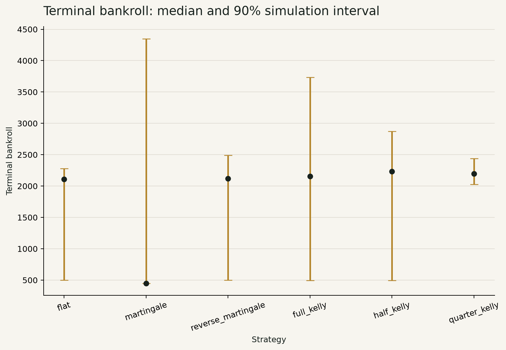

# Optimal Betting Strategy Simulator

## A Statistical Laboratory for Roulette Bias, Bankroll Risk and Decision-Making

**Author:** Jialiang Gong  
**Portfolio version:** 0.1.0  
**Academic foundation:** University of Manchester MATH20062 Group 40 report, 2024/25  
**Scope:** Independent Python reimplementation and extension from the report's mathematical specification

## Executive Summary

This project turns an undergraduate roulette investigation into a reproducible analytical product. It combines exact probability, statistical inference, Monte Carlo simulation, bankroll modelling, automated testing, and interactive design. Roulette is useful here because its rules are compact but its interpretation is not. A complete analysis must distinguish the expected value implied by the contract, the evidence supplied by observed spins, and the decisions made under an uncertain probability estimate.

The exact calculations establish the baseline. A unit straight bet on a fair European wheel has expected net return `-1/37`, giving a house edge of approximately 2.70%. The comparable American bet has an edge of approximately 5.26% because the extra `00` pocket raises the number of losing outcomes while the 35:1 payout remains unchanged. For a European even-money bet, the implemented La Partage and En Prison rules reduce the edge to approximately 1.35%. No conventional staking sequence alters these per-unit expectations.

Two deterministic samples illustrate inference. In the fair 1,000-spin sample, the hottest pocket appears 39 times. A naive binomial tail calculation gives `p = 0.0164`, but this pocket was selected after all 37 counts were inspected. A family-wise maximum-count simulation gives `p = 0.4837`, and the global chi-squared asymptotic value is `p = 0.3978`. The corrected analysis provides no reason to reject fairness. In the synthetic biased sample, pocket 17 has generating probability 0.060 and appears 61 times. The global asymptotic value is `p = 0.0029`, the global Monte Carlo value is `p = 0.0044`, and the family-wise maximum-count value is approximately `0.0001`. The distinction demonstrates why the selection procedure belongs inside the test.

Bankroll experiments compare flat betting, Martingale, reverse Martingale, and full, half, and quarter Kelly staking. These experiments deliberately use the favourable synthetic probability so that sizing behavior can be studied. In 3,000 paths of up to 300 spins, Martingale has a median terminal bankroll of 450 from a starting value of 1,000 and a 65.57% probability of finishing below the start. Quarter Kelly has a median of 2,198 and a 1.67% probability of loss in the same assumed scenario. This is a conditional risk comparison, not evidence that the assumed advantage exists on a real wheel.

The main contribution is the connection between mathematical discipline and usable software. The repository includes a typed package, 180+ tests, strict CSV handling, seven machine-readable result tables, six figures, an executed notebook, a Streamlit dashboard, this report, a technical blog, provenance records, and application materials. Together they show an answer and the chain of work that generated, checked, communicated, and limited it.

## Provenance

The academic foundation is the University of Manchester MATH20062 2024/25 Group 40 main project. The authors listed on that report are Jialiang Gong, Joseph Myatt, Jessica Sathiyanathan, Jacob Tinker, and Chenyue Wang. The report examined roulette through probability, expectation, simulation, and statistical testing. Its local SHA-256 checksum is `0364398a2cdcc91b1653604a9ca1b7adfaac529d99bc8e115f53475fa49c40e5`.

The source PDF is not included in the public repository because consent from every coauthor to republish it has not been established. The checksum and bibliographic description preserve an auditable connection without distributing the file. Any description of the original report should retain collective attribution.

This portfolio is Jialiang Gong's individual extension. It is an independent Python reimplementation from the paper's mathematical specification. The original MATLAB source code was unavailable, so a claim of direct code migration would be inaccurate. The new work includes software architecture, complete table-bet geometry, exact special-rule handling, corrected post-selection inference, Bayesian updating, power analysis, a constrained bankroll engine, deterministic publication outputs, an executable notebook, an interactive dashboard, and automated verification.

The extension also addresses two points that could otherwise distort interpretation. First, the expected net return of a fair European straight bet is negative rather than zero. The stake is lost in 36 of 37 outcomes and earns 35 units in one outcome, producing `35/37 - 36/37 = -1/37`. Second, the most frequent pocket in a sample cannot be tested as if it had been fixed before the data were observed. This report shows the naive result, then replaces its decision role with global and family-wise procedures.

## Problem Definition

The project is organised around three layers of uncertainty. The rules layer asks what happens if the wheel probabilities and payout rules are known. The evidence layer asks what a finite sequence of observed spins can reveal about those probabilities. The decision layer asks how a staking policy changes wealth paths when a probability model is supplied. Mixing these layers can create a confident but invalid answer.

At the rules layer, the inputs are wheel type, legal bet, net payout odds, stake, and any special handling of zero. The desired output is exact expected net return and house edge. This is a finite probability calculation and should not need simulation. Exact enumeration is clearer and avoids Monte Carlo noise.

At the evidence layer, the input is a categorical spin sequence. The first question is global: is the entire count vector compatible with the stated wheel? The second question concerns a highlighted pocket. If that pocket was specified before data collection, a one-pocket test may be suitable. If it was selected for being hottest, the null distribution must repeat the same search. The layer also needs power analysis because a failure to reject fairness can mean either that the wheel is close to fair or that the experiment is too weak to detect the departure.

At the decision layer, the input includes an assumed win probability and operating constraints. Strategies are compared through terminal wealth, probability of loss, drawdown, and path distributions. An arithmetic mean alone is inadequate because skewed outcomes can make the average unlike a typical path. The simulator therefore reports medians, percentiles, and drawdown alongside means.

The phrase "optimal betting strategy" requires care. In this report, full Kelly is optimal only in the narrow mathematical sense of maximising expected logarithmic wealth growth under a correct, stationary probability and repeated comparable opportunities. It is not optimal for every risk preference, horizon, table constraint, or estimation error. Fractional Kelly policies are included to show how reduced sizing changes risk.

## Mathematical Model

A wheel is represented by a finite set of labelled pockets and a probability vector that sums to one. The European wheel has 37 labels, `0` through `36`. The American wheel has 38 labels because it adds `00`. A fair wheel assigns equal probability to every label. A synthetic single-pocket alternative assigns a chosen label probability `q` and distributes the remaining mass evenly across all other labels.

A bet is a set of winning pockets with a net payout multiple `b`. If the unit stake is returned separately on a win, the net outcome is `b` when the ball lands in the winning set and `-1` otherwise. For win probability `p`,

```text
E[X] = p b - (1 - p).
house edge = -E[X].
```

The implementation covers straight, split, street, corner, six-line, dozen, column, and standard outside bets. Coverage is derived from canonical roulette-table geometry rather than accepted as an arbitrary list. Validation rejects shapes that are not adjacent on the table and rejects `00` on a European wheel.

La Partage applies to European even-money bets. When zero appears, half the stake is returned, so the net outcome on zero is `-1/2` instead of `-1`. With 18 wins, 18 ordinary losses, and one zero, the expected net return is `18/37 - 18/37 - 1/(2 x 37) = -1/74`.

En Prison is modelled as a state process. On zero, the stake becomes imprisoned rather than being immediately resolved. A later win returns the original stake with zero profit; a later loss loses it; another zero leaves it imprisoned. Solving the recursive expectation gives the same `-1/74` edge for the fair European even-money setting implemented here. The bankroll engine tracks imprisoned stake separately from liquid cash and reports marked-to-model equity so temporary illiquidity is not mistaken for a realised loss.

For fairness testing, observed counts `O_i` are compared with expected counts `E_i = n p_i`. Pearson's statistic is

```text
chi-square = sum((O_i - E_i)^2 / E_i).
```

Under regular conditions and a fully specified null, it is compared with a chi-squared distribution with `k - 1` degrees of freedom. The package also estimates a global p-value by drawing multinomial count vectors under the null. The add-one estimator `(extreme + 1)/(simulations + 1)` prevents a reported zero from finite Monte Carlo work.

For the hottest-pocket question, each null simulation calculates its own maximum count. The family-wise p-value is the proportion whose maximum is at least the observed maximum. This reproduces both the random spins and the selection rule. A Bonferroni-adjusted one-pocket value is also reported as a conservative reference, but the direct maximum-count simulation matches the question more closely.

A Dirichlet prior supplies an uncertainty distribution for pocket probabilities. Adding categorical counts to the prior parameters produces the posterior. Posterior means and intervals provide a reminder that a point estimate is not known truth. A train/validation split supports a second check: selection occurs on training data, then evidence is evaluated on data not used to nominate the pocket.

The Kelly fraction for a binary bet is

```text
f* = (b p - (1 - p)) / b.
```

Negative values are clipped to zero because the implemented strategies do not short a roulette bet. Half and quarter Kelly multiply the positive fraction by 0.5 and 0.25. Actual stakes are then rounded to chip size and constrained by liquid cash and the table limit. These operational steps mean realised behavior can differ from an unconstrained formula.

## Implementation

The codebase follows a layered design. `wheels.py` defines immutable wheel specifications and constructors for fair and biased distributions. `bets.py` owns legal geometry, coverage, exact expectation, special rules, and Kelly calculations. `statistics.py` owns categorical inference, residuals, Monte Carlo calibration, posterior updating, and data splitting. `bankroll.py` owns path state, stake policies, prison state, stopping rules, and risk summaries.

Data ingestion is strict. Pocket labels are treated as strings so American `00` is not silently converted to numeric zero. Invalid labels, non-sequential indexes, incompatible wheel declarations, and malformed probability vectors raise explicit errors. Example data are produced by fixed NumPy generators and can be recreated from the analysis script.

`analysis.py` composes the components into a single `AnalysisBundle`. It writes seven CSV tables and six figures. This shared bundle prevents the notebook and report from maintaining separate formulas. The report builder reads headline values from the CSV files. If the analysis changes, the publication layer changes with it or a verification check fails.

Testing scales with the mathematical risk. Unit tests cover probability mass, every bet family, special rules, edge cases at probability zero and one, Monte Carlo result structure, bankroll constraints, and En Prison transitions. Integration tests run the output pipeline, rebuild the notebook, check the dashboard's public interface, and inspect publication requirements. Stable seeds are used where exact repeatability matters, while tests of statistical procedures focus on valid bounds and designed synthetic alternatives.

The notebook is generated programmatically with deterministic cell identifiers, then executed through `nbclient`. It moves from wheel construction through expectation, convergence, fairness, power, and bankroll analysis. This gives a reader a linear teaching route while keeping production logic in importable modules.


The Streamlit app calls the same package functions. It has four tabs: Wheel & Bets, Fairness Lab, Bankroll Simulator, and Methods & Limits. Parameters include wheel, bet, special rule, dataset, assumed pocket probability, bankroll, base stake, number of spins, paths, stop-loss, take-profit, table limit, and strategy. Standard casino odds and hypothetical custom odds are visually separated.

## Unbiased-Wheel Results

The analytical house-edge table confirms the denominators. A European straight bet loses approximately 2.70% of stake in expectation, while an American straight bet loses approximately 5.26%. The same 2.70% edge applies to a standard European red bet because the payout is adjusted to the coverage but not to zero. La Partage and En Prison halve the even-money edge to approximately 1.35%.


The law-of-large-numbers figure follows the running frequency of pocket 17 under a seeded fair-wheel simulation. Early frequencies move sharply because each observation carries great weight in a small denominator. As the sample grows, the path settles nearer `1/37`, although convergence does not mean monotonic movement or exact equality. The graph is a visual account of sampling variation, not a claim that a particular finite path must behave smoothly.


In the fair example dataset, there are 1,000 observations and an expected count of approximately 27.03 per pocket. The hottest pocket is 32 with a count of 39. Pearson's statistic is approximately 37.554. The asymptotic global p-value is `0.3978`, and the Monte Carlo global p-value is `0.3974`. Their closeness is reassuring because expected counts are comfortably above five.

The naive pocket-specific result is intentionally displayed. Its `p = 0.0164` can look significant at 5%, but it answers a different question: how surprising would at least 39 appearances be for one pocket fixed in advance? The experiment instead asked which of 37 pockets would be largest and then inspected that maximum. A Bonferroni value of `0.6067` and a family-wise simulation value of `0.4837` account for the search. Neither suggests a departure from fairness.

This example shows why reporting every numerical result is not enough. A result can be calculated correctly for the wrong experimental question. Reliability comes from matching the null simulation to the full analysis procedure.

## Bias Detection and Correction

The biased teaching dataset uses a known data-generating mechanism. Pocket 17 has probability 0.060. Each other European pocket receives `(1 - 0.060)/36`. A fixed seed generates 1,000 spins, of which 61 land on pocket 17. Because the source of the data is known, the experiment can evaluate whether the detection methods respond to a meaningful departure.

The global chi-squared statistic is approximately 63.824. Its asymptotic p-value is `0.0029`, while the multinomial Monte Carlo global value is `0.0044`. The selected-pocket naive p-value is extremely small, but the more relevant family-wise maximum-count value is approximately `0.0001`. All three corrected global views point away from fairness for this synthetic sample.


Pearson residuals show which categories contribute to the statistic. Pocket 17 stands above the remaining counts, but residual plots should be interpreted after the global test rather than used as an unrecorded search for a new one-pocket hypothesis. The dashboard therefore places the global result and selection warning next to the residual display.

Power analysis repeats complete experiments at controlled alternatives. With 1,000 spins and a 5% decision threshold, the estimated rejection rate is approximately 5.27% when the target probability equals the fair `1/37`, close to the nominal false-positive rate. At probability 0.050, estimated power rises to approximately 58.97%. At 0.065, it is approximately 97.47%, and at 0.080 it is approximately 99.97%. Each estimate uses 3,000 Monte Carlo experiments and reports a Monte Carlo standard error.


Power is essential when interpreting a non-significant result. It separates "the model appears compatible with the data at detectable effect sizes" from "the wheel has been proved fair." The experiment has high power for the strong 0.060 alternative, but much less power for subtle departures. A real audit would also need a sampling protocol, equipment history, independence checks, and out-of-sample confirmation.

The correction process improves reliability in four ways. It uses a global test before local diagnosis, repeats selection inside the Monte Carlo null, makes the synthetic status of the alternative explicit, and pairs p-values with power and uncertainty. These choices reduce the chance that a striking count is converted into a larger claim than the evidence supports.

## Strategy Risk

The bankroll study does not search historical outcomes for a profitable rule. It supplies the known synthetic probability `p = 0.060` for a straight bet on pocket 17 at standard 35:1 net odds. The starting bankroll is 1,000, the path horizon is up to 300 spins, the stop-loss level is 500, the take-profit level is 2,000, and the table limit is 100. There are 3,000 seeded paths per strategy.

Flat betting has terminal mean approximately 2,009, median 2,110, and probability of loss 7.10%. Reverse Martingale has mean approximately 2,039, median 2,120, and probability of loss 7.50%. Martingale has mean approximately 1,616 but median only 450, with 65.57% of paths below the starting bankroll. Its mean is pulled upward by a smaller set of large outcomes, while a typical path hits a severe constraint. This gap between mean and median is exactly why distributional reporting matters.

Full Kelly has mean approximately 1,891, median 2,155, and probability of loss 37.90%. Its expected maximum drawdown is about 38.86%. Half Kelly lowers the probability of loss to 13.83% and the expected maximum drawdown to about 32.45%. Quarter Kelly has mean approximately 2,159, median 2,198, probability of loss 1.67%, and expected maximum drawdown about 24.54%.



These figures do not imply that quarter Kelly is universally best. The stop and table rules interact with stake sizing, the path horizon is finite, and the supplied edge is unusually large. Full Kelly targets long-run expected log growth without promising the smallest drawdown or the best median at a chosen finite horizon. Fractional policies can perform better on those criteria because they take less risk and are less affected by stake discretisation and stopping boundaries.

Probability error is the dominant caveat. The straight-bet break-even probability at 35:1 is `1/36`, approximately 0.02778. A pocket believed to have probability 0.030 yields a very small positive full Kelly fraction, about 0.00229. At the fair European probability of `1/37`, the fraction is zero after clipping. Small estimation changes around break-even therefore reverse the decision. A posterior distribution or held-out estimate is more informative than substituting a noisy sample frequency into Kelly's formula.

Martingale illustrates a different misconception. Doubling after losses changes the timing and concentration of outcomes but not the expectation of the underlying wager. Finite bankrolls and table limits prevent indefinite recovery. Stop-loss and take-profit rules can manage exposure; they cannot manufacture a positive edge.

## Product Design

The dashboard is designed as an analytical workspace rather than casino entertainment. The palette uses off-white surfaces, dark green for structure, red for losses or warnings, and restrained gold for emphasis. It avoids roulette imagery, flashing animation, decorative gradients, and promotional language. The goal is to help a reader compare assumptions and evidence without encouraging play.

The first tab establishes the finite sample space and contract. Users can switch between European and American wheels, inspect legal coverage, and compare exact expectation under available rules. The second tab moves to evidence. It can load the fair or biased example data, accepts validated CSV input, displays residuals, and places naive and corrected p-values together. The third tab exposes bankroll assumptions and shows paths plus risk summaries. The final tab documents formulas, limits, and responsible interpretation.

Controls are selected by type. Toggles handle binary choices, menus handle option sets, and numeric inputs or sliders handle quantities. Stable plot containers prevent results from shifting the page. Desktop and mobile checks verify that labels wrap, metrics remain readable, and no content overlaps.

The product also has an epistemic design. Standard casino payouts are the analytical default. A user may enter custom odds, but the interface labels them hypothetical and confines them to scenario simulation. A prominent distinction separates a known input from an estimated probability. This reduces the risk that a user treats a fitted count as a guaranteed future rate.

Reproducibility is part of the interface contract. Seed inputs allow a scenario to be repeated. Downloadable tables retain machine-readable values. The dashboard shares domain functions with the report pipeline, so visual interaction does not depend on duplicate hidden formulas.

## Application Value

The project provides practical evidence of mathematical training. Finite probability spaces and expectation come from core undergraduate probability. The law of large numbers, categorical testing, effect size, Monte Carlo error, Bayesian updating, and random processes connect theory to evidence. Kelly staking introduces optimisation under multiplicative wealth, while drawdown and stopping rules show why an objective function must match the user's risk criterion.

It also demonstrates software engineering. The code separates responsibilities, validates inputs, uses immutable specifications, pins dependencies, and tests public behavior. A deterministic build produces datasets, tables, figures, notebook output, and report inputs. These features make the work easier to audit than a single script or presentation screenshot.

For digital transformation study, the repository shows how a static academic result can become a governed product. The transformation includes a data contract, reusable analytical services, a user interface, automated quality checks, and documented decision limits. For knowledge and technology management, it captures analytical choices in a form that can be transferred and reviewed. For big data technology, Monte Carlo path generation, vectorised computation, reproducible pipelines, and statistical validity form a small but complete model of production analytics.

The AI workflow adds another relevant capability. AI assisted with decomposition, test ideas, review, and language editing, but outputs were checked against calculations, tests, deterministic artifacts, and provenance. This is a stronger demonstration than simply claiming familiarity with a tool. It shows where automation helps and where judgement remains necessary.

The most transferable result is the post-selection correction. Many business analyses choose the best-performing product, region, campaign, or customer segment and then test it as though it had been nominated beforehand. The maximum-count simulation is a compact example of how an analytical workflow can model its own search process. That lesson applies to anomaly detection, A/B test slicing, feature screening, and model selection.

## Limitations

The supplied datasets are synthetic and contain only pocket labels. They do not identify a casino, physical wheel, dealer, time stamp, spin speed, ball, maintenance event, or environmental condition. They are suitable for validating methods and teaching interpretation, not for making claims about a real venue.

The wheel model assumes independent, identically distributed spins with a stationary probability vector. A physical process could drift over time or exhibit dependence. A single categorical goodness-of-fit test would not diagnose those mechanisms. Time-aware methods, change-point analysis, and a sampling plan would be needed.

The biased alternative raises one pocket and spreads the remaining mass evenly. Real mechanical bias could affect neighbouring pockets or sectors. The European wheel layout figure shows physical order, but the current primary alternative does not model sector-level effects. A future extension could compare structured alternatives while controlling the expanded model-selection process.

Asymptotic chi-squared inference depends on adequate expected counts. The current 1,000-spin examples satisfy the usual count condition. Smaller samples should rely more heavily on exact or Monte Carlo calibration. Monte Carlo p-values and power estimates also have simulation error, which is why seeds, experiment counts, and standard errors are recorded.

The strategy results are conditional on a probability that is supplied rather than learned robustly from real data. Kelly is particularly sensitive to this assumption. Transaction frictions, rule variation, measurement mistakes, wheel changes, and legal or operational restrictions are absent. No simulated advantage should be interpreted as a recommendation to gamble.

Stopping rules complicate comparisons. Paths may finish at different times, and terminal values can cross a boundary by the amount of the last realised wager. A zero recorded probability of ruin in the published scenario reflects the configured stop-loss and simulation definitions; it is not a general statement that a strategy cannot lose its bankroll.

Finally, the source report's original code was unavailable. The Python package was reconstructed from mathematical descriptions and checked independently, but it cannot demonstrate source-level equivalence with the earlier MATLAB implementation. This limitation is stated rather than hidden because accurate provenance is part of technical quality.

## Conclusion

Roulette provides a controlled setting for a broad analytical lesson. Exact expectation describes the rules. Statistical inference evaluates finite evidence. Simulation reveals path risk. Optimisation chooses an objective only after assumptions and preferences are specified. A dashboard makes those assumptions inspectable, while tests and deterministic outputs connect claims to code.

The fair sample produced an attractive but misleading hottest-pocket result. Once the selection step was included, the evidence was compatible with fairness. The synthetic biased sample was detected by global and family-wise procedures, and the power curve explained which alternatives the experiment could reliably identify. Bankroll simulations then showed that progression systems, Kelly fractions, and constraints change distributions without validating the probability input.

The finished portfolio therefore contributes more than a betting simulator. It demonstrates the ability to reconstruct mathematics in Python, find a methodological weakness, design a correction, validate software behavior, communicate uncertainty, and turn analysis into a usable product. Those are the parts of the work that transfer to data, technology, and decision-making beyond roulette.

## References

1. Gong, J., Myatt, J., Sathiyanathan, J., Tinker, J., and Wang, C. (2024/25). *MATH20062 Group 40 Main Project*. University of Manchester. Unpublished group report.
2. Kelly, J. L. Jr. (1956). A New Interpretation of Information Rate. *Bell System Technical Journal*, 35(4), 917-926.
3. Pearson, K. (1900). On the Criterion that a Given System of Deviations from the Probable Can Be Reasonably Supposed to Have Arisen from Random Sampling. *Philosophical Magazine*, 50(302), 157-175.
4. Bonferroni, C. E. (1936). Teoria statistica delle classi e calcolo delle probabilita. *Pubblicazioni del R Istituto Superiore di Scienze Economiche e Commerciali di Firenze*, 8, 3-62.
5. Bernardo, J. M., and Smith, A. F. M. (1994). *Bayesian Theory*. Wiley.
6. Rubinstein, R. Y., and Kroese, D. P. (2016). *Simulation and the Monte Carlo Method*. Wiley.
